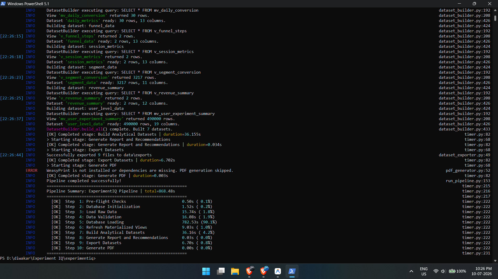

# ExperimentIQ: Enterprise A/B Testing & Analytics Pipeline

ExperimentIQ is an end-to-end data engineering and statistical analytics pipeline designed to simulate, ingest, validate, and analyze massive volumes of A/B testing telemetry data. 

Built to production-grade standards, this project demonstrates a modern data architecture capable of generating and processing over **7 million synthetic events** in under 15 minutes, moving them from raw generation through strict validation, high-speed PostgreSQL ingestion, and advanced statistical analysis.

---

## 🚀 Key Features



*   **Massive Data Synthesis:** Generates a realistic, highly-relational dataset of Users, Experiments, Sessions, Events, and Orders with built-in anomalies, funnel drop-offs, and realistic temporal distributions.
*   **High-Throughput Database Ingestion:** Utilizes `psycopg2` COPY operations to bypass standard ORM bottlenecks, achieving ingestion rates exceeding 20,000 rows/second into PostgreSQL.
*   **Rigorous Data Quality Guardrails:** Implements 66 distinct business logic checks (referential integrity, temporal boundary enforcement, bounce rate consistency, revenue sanity) before any data touches the database.
*   **Advanced Statistical Engine:** Custom Python implementation of Two-Proportion Z-Tests, Wilson Score Intervals, Statistical Power Analysis, and Chi-Square Sample Ratio Mismatch (SRM) detection.
*   **Optimized SQL Analytics Layer:** Offloads heavy aggregations to PostgreSQL Materialized Views and CTEs (funnel drop-off, segmentation, daily metrics) for instant reporting performance.
*   **Automated Reporting:** Generates clean, analytical datasets (exported as CSV for BI tools) and automated PDF reports (via WeasyPrint/Jinja2).

---

## 🏗️ Architecture Overview

The pipeline executes sequentially via a single orchestrator (`run_pipeline.py`), timed and logged at every stage:

1.  **Pre-flight Checks:** Verifies DB connectivity, disk space, and configuration (`.env`).
2.  **Database Initialization:** Deploys the PostgreSQL schema, indexes, and materialized views.
3.  **Data Generation:** Synthesizes millions of rows of analytical data in memory using Pandas.
4.  **Data Validation:** Traverses all DataFrames to ensure absolute data integrity.
5.  **Database Loading:** Bulk inserts validated data into PostgreSQL via highly optimized `COPY` commands.
6.  **Analytics & Statistics:** Calculates lift, confidence intervals, and p-values using `scipy.stats`.
7.  **Export:** Flushes the finalized metrics to `data/exports` for Power BI/Tableau ingestion.

---

## 🛠️ Technology Stack

*   **Language:** Python 3.12+
*   **Database:** PostgreSQL 16+
*   **Data Processing:** Pandas, NumPy
*   **Statistics:** SciPy
*   **Database Interfacing:** SQLAlchemy, psycopg2-binary
*   **Validation & Config:** Pydantic V2, Pydantic-Settings
*   **Reporting:** Jinja2, WeasyPrint (Optional)

---

## 💻 How to Run Locally

### Prerequisites
*   Python 3.12+
*   PostgreSQL running locally (default port 5432)

### Setup Instructions

1. **Clone the repository:**
   ```bash
   git clone https://github.com/yourusername/ExperimentIQ.git
   cd ExperimentIQ
   ```

2. **Install dependencies:**
   ```bash
   pip install -r requirements.txt
   ```

3. **Configure the Environment:**
   Copy the example environment file and update your PostgreSQL credentials if necessary.
   ```bash
   cp .env.example .env
   ```

4. **Run the Pipeline:**
   Execute the orchestrator. The pipeline will automatically generate 7M+ rows of data, validate it, and load it into your database.
   ```bash
   python run_pipeline.py
   ```
   *(Note: Add `--skip-generation` if you have already generated the raw CSVs and just want to re-run the ingestion and analytics).*

---

## 📁 Project Structure

```text
experimentiq/
├── config/                 # Pydantic Settings & Environment Configurations
├── data/                   # Local storage for raw, processed, exports, and logs
├── sql/                    # Core SQL logic (Metrics, Funnels, Segments, Schema)
├── src/
│   ├── analytics/          # Data assemblers and business metric calculations
│   ├── generators/         # Synthetic data generators (Users, Events, Orders, etc.)
│   ├── ingestion/          # High-speed BulkLoader and Database Connections
│   ├── recommendations/    # Automated decision engine based on statistical significance
│   ├── reporting/          # PDF and Dataset Exporters
│   ├── statistics/         # Z-tests, Confidence Intervals, Power Analysis, SRM Detection
│   ├── validation/         # Data Quality and Schema Validation Engines
│   └── utils/              # Pipeline Timers and formatters
├── run_pipeline.py         # Main Orchestrator
└── README.md
```
